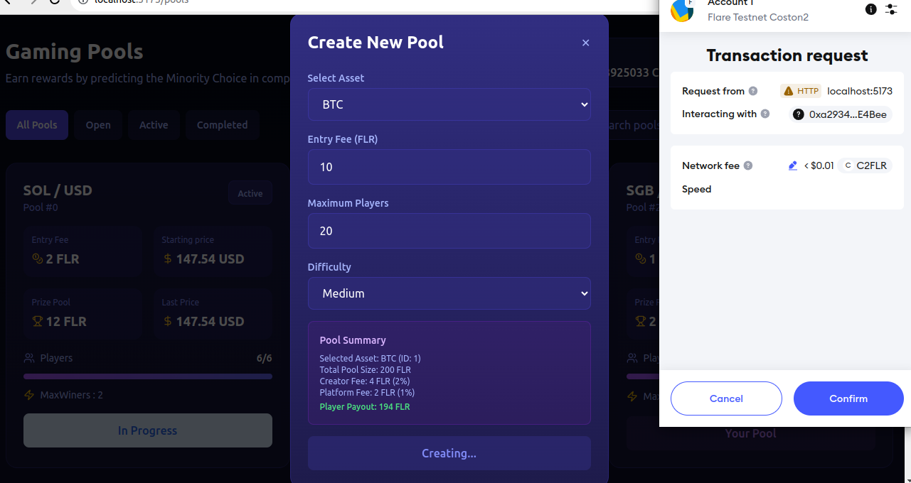

# FlareFlip: Decentralized Prediction Game on Flare Network

## Overview

FlareFlip is an innovative decentralized prediction game built on the Flare Network. This project leverages Flare's unique Oracle infrastructure (FTSO) and Random Number Generator to create a fair, transparent, and engaging "Heads or Tails" prediction game where skill and psychology matter more than luck.

Unlike traditional prediction games, FlareFlip implements a **"Minority Wins"** mechanism that rewards strategic thinking rather than following the crowd, creating a more balanced and unpredictable gameplay experience.

## Table of Contents

- [Problem statement](#problem-statement-&-solution)
- [Features](#features)
- [Play on explorer](#play-on-explorer)
- [Technical Implementation](#technical-implementation)
  - [Smart Contract Architecture](#smart-contract-architecture)
  - [Flare Network Integration](#flare-network-integration)
- [🎮 User Story](#🎮-user-story)
- [How to Play](#how-to-play)
- [Future Roadmap/Vision](#future-roadmap)
  - [Phase 1: Core Game enhancement](#phase-1-core-game-enhancement)
  - [Phase 2: Ecosystem Expansion](#phase-2-ecosystem-expansion)
- [Getting Started](#🚀-getting-started)
- [Deployment](#deployment)
- [Testing](#testing)
- [Security](#security)
- [License](#license)

## Problem Statement & Solution

Traditional prediction games often rely heavily on luck rather than skill, with centralized control creating trust issues and lack of transparency. Additionally, most prediction games use a **_'Majority wins'_** mechanism that encourages herd mentality rather than strategic thinking. This creates stale gameplay where outcomes become predictable and users have limited opportunity to apply actual strategy or psychological insight.

FlareFlip addresses these issues by:

1. Using Flare Network's decentralized infrastructure to create a transparent, trustless prediction platform
2. Implementing the innovative **"Minority Wins"** mechanism that rewards strategic thinking and psychological insight rather than luck or following the crowd
3. Leveraging FTSO for reliable price feeds and the Random Number Generator for fair outcomes
4. Creating a more engaging gameplay experience that requires players to think about what other players might choose and letting asset movements & VRF resolve any tie-break scenario

## Features

- **Decentralized Prediction Game**: Participate in "Heads or Tails" prediction pools based on psychology and real-world asset price movements from FTSO
- **Minority Wins Mechanism**: Strategic gameplay where the minority choice often prevails
- **Flare Network Integration**: Utilizes Flare's Time Series Oracle (FTSO) for reliable price feeds
- **Secure Randomness**: Employs Flare's Random Number Generator for fair tiebreaking
- **Staking Mechanism**: Pool creators stake FLR tokens to create and manage pools
- **Multi-Round Elimination**: Progressive rounds with eliminations until final winners are determined
- **Transparent Prize Distribution**: Smart contract enforces automatic prize payouts
- **Multiple Asset Categories**: Support for crypto, commodities, and forex price movements
- **Creator Rewards**: Pool creators/Stakers earn a percentage of the prize pool

## Play on Explorer

The contract is deployed and verified on the coston2 network
You can interact with the smart contract here: https://coston2-explorer.flare.network/address/0xa29340ad99409467d8b8f9375987d5b08ffe4bee

#[Link to contract on Coston2 explorer](https://coston2-explorer.flare.network/address/0xa29340ad99409467d8b8f9375987d5b08ffe4bee)

## Technical Implementation

### Smart Contract Architecture

FlareFlip is built using Solidity with extensive use of data structures for efficient game management:

```solidity
contract FlareFlip is Ownable {
    enum PlayerChoice { NONE, HEADS, TAILS }
    enum PoolStatus { OPENED, ACTIVE, CLOSED }

    struct TradingPair { ... }
    struct MarketData { ... }
    struct Player { ... }
    struct Pool { ... }
    struct PoolInfo { ... }
    struct StakerInfo { ... }

    // Core game logic and state management
    ...
}
```

FlareFlip employs a modular smart contract architecture with specialized components:

1. **FlareFlipBase**: Core infrastructure, staking mechanism, and Flare Network service connections
2. **FlareFlipPoolManagement**: Pool creation and participant management
3. **FlareFlipGameLogic**: Game mechanics, round resolution, and tie-breaking
4. **FlareFlipPrizeDistribution**: Winner determination and reward distribution
5. **FlareFlipViews**: Query functions for frontend integration

### ⚡ Flare Network Integration

FlareFlip deeply integrates three core Flare Network services to deliver a transparent and fair gaming experience:

1. **FTSO (Flare Time Series Oracle)**: Provides decentralized, reliable price feeds for various assets. Admin gets to add supported price feeds from FTSO for stakers to create pools

   ```solidity
   // FTSO V2 integration to get reliable price feeds
   FtsoV2Interface public ftsoV2;
   function updateMarketPrice(uint _poolId) public {
    // Get real-time price data from Flare's decentralized oracles
    MarketData storage data = poolMarketData[_poolId];
    data.updateMarketData(
        pool.feedId,
        ftsoV2,
        feedFees[pool.feedId]
    );
   }
   ```

   ```solidity
    /**
     * @dev Add a supported asset (admin only)
     * @param _category Asset category (e.g., 1 for crypto, 2 for commodities, 3 for forex)
     * @param _categoryName Human-readable category name
     * @param _symbol Asset symbol (e.g., "FLR","BTC","XRP")
     * @param _feedId Flare FTSO feed ID
     */
    function addSupportedAsset(
        uint8 _category,
        string memory _categoryName,
        string memory _symbol,
        bytes21 _feedId
    ) external onlyOwner {
        if (bytes(_symbol).length == 0) revert SymbolEmpty();
        if (bytes(_categoryName).length == 0) revert CategoryNameEmpty();
        if (_feedId == bytes21(0)) revert InvalidFeedId();
        if (isAssetSupported[_symbol]) revert AssetAlreadySupported();

        // Store the relationship between category, name and feed ID
        categoryNameToFeedId[_categoryName][_symbol] = _feedId;
        assetToFeedId[_symbol] = _feedId;
        feedCategories[_feedId] = _category;

        // ...
    }
   ```

2. **Random Number Generator**: Ensures fair and unpredictable outcomes for tie-breaking

   ```solidity
   // Flare's verifiable random number service integration
    RandomNumberV2Interface public randomNumberV2;
    function _resolveTie(uint _poolId, uint _round) internal returns (PlayerChoice) {
        // Get cryptographically secure random number from Flare
        uint256 randomValue = randomNumberV2.getRandomNumber(
            _poolId,
            _round,
            roundRandomNumbers
        );
        // Use random number in hybrid resolution algorithm
        // ...
    }
   ```

   ```solidity
   /**
     * @dev Resolve a tie by using market data and random number from flare's vrf
     * @param _poolId ID of the pool
     * @param _round Current round number
     * @return The winning selection
     */
    function _resolveTie(uint _poolId, uint _round) internal returns (PlayerChoice) {
        Pool storage pool = pools[_poolId];
        MarketData storage data = poolMarketData[_poolId];

        // Force price update if stale
        data.updateMarketData(
            pool.feedId,
            ftsoV2,
            feedFees[pool.feedId]
        );

        // Get fresh random number
        uint256 randomValue = randomNumberV2.getRandomNumber(
            _poolId,
            _round,
            roundRandomNumbers
        );

        bool priceIncreased = (data.lastPrice > data.startPrice);
        bool randomEven = (randomValue % 2 == 0);

        // HEADS wins if: (price↑ AND random even) OR (price↓ AND random odd)
        if ((priceIncreased && randomEven) || (!priceIncreased && !randomEven)) {
            emit TieBrokenByHybrid(
                _poolId,
                _round,
                data.startPrice,
                data.lastPrice,
                randomValue,
                PlayerChoice.HEADS
            );
            return PlayerChoice.HEADS;
        } else {
            emit TieBrokenByHybrid(
                _poolId,
                _round,
                data.startPrice,
                data.lastPrice,
                randomValue,
                PlayerChoice.TAILS
            );
            return PlayerChoice.TAILS;
        }
    }
   ```

3. **Fee Calculator**: Manages the fees required for oracle data requests
   ```solidity
   // Fee calculation for oracle data requests
    IFeeCalculator public feeCalculator;
    function initializeMarketData() {
        // Calculate appropriate fee for the data request
        bytes21[] memory feedIds = new bytes21[](1);
        feedIds[0] = feedId;
        uint256 fee = feeCalculator.calculateFeeByIds(feedIds);
        // ...
    }
   ```

These integrations are implemented through Flare's contract registry system:

```solidity
constructor() Ownable(msg.sender) {
    ftsoV2 = ContractRegistry.getFtsoV2();
    feeCalculator = ContractRegistry.getFeeCalculator();
    randomNumberV2 = ContractRegistry.getRandomNumberV2();
    poolCount = 0;
}
```

## 🎮 User Story

### 0. Scouting Pools

Jordan heard about the viral **minority** prediction game on Flare blockchain network and decided to visit the platform. She saw the pools and noticed how the price of each pool based on crypto asset was updating. She went through How to Play section, understood the flow and decided to leverage the benefit and became a staker.


### 1. Pool Creation

As a staker, Jordan wants to create an engaging prediction pool from assets supported on the platform from the FTSO feeds. She:

- Stakes 20 FLR to become eligible as a pool creator
- Creates a new Bitcoin price prediction pool with an entry fee of 10 FLR
- Sets a maximum of 20 participants and awaits/invites players to join

```
"I love creating pools based on Bitcoin price movements. The 5% creator fee gives me an incentive to bring in active players, and I can create up to 3 pools simultaneously to maximize my earnings."
```



### 2. Joining a Pool

Alex discovers Jordan's prediction pool and decides to participate:

- Views available pools and their details (asset, entry fee, participant count)
- Pays the 10 FLR entry fee to join the Bitcoin prediction pool
- Receives confirmation of successful entry

```
"I joined this BTC pool because I love BTC, I like the entry fee and participant count. With 20 players, the prize pot is substantial, and having multiple rounds keeps the game interesting."
```

 

### 3. Making Predictions

Once the pool is full with 20 participants, the game begins:

- All players, including Alex, choose either HEADS or TAILS
- A countdown timer ensures all players make their selection
- Alex thinks most players will choose HEADS, so he strategically selects TAILS
- The system records all predictions securely on-chain, thanks to Flare Blockchain

```
"The minority wins mechanism makes this game so much more strategic than regular prediction games. I need to anticipate what others will choose, not just predict price movements or make random guesses."
```


### 4. Round Resolution

![Round Results Screen]

After all selections are made:

- The system tallies the votes: 12 players chose HEADS, 8 chose TAILS
- The minority selection (TAILS) wins this round
- The 12 players who chose HEADS are eliminated
- Alex advances to the next round along with 7 other survivors

```
"I made it through the first round by guessing the minority correctly! It becomes more challenging in later rounds with fewer players, as everyone is using similar strategy."
```

### 5. Tie Breaking

![Tie Breaking Screen]

In the second round, the remaining 8 players are evenly split:

- 4 players choose HEADS and 4 choose TAILS
- The system activates the unique hybrid tie-breaking system
- Flare's FTSO provides the BTC price movement direction
- Flare's Random Number Generator creates a secure random value
- The system combines both inputs to determine HEADS as the winner
- Players who chose TAILS are eliminated

```
"The tie-breaking mechanism is genius - it's unpredictable but not random. Combining price movement with a random number means you can't game the system, but skilled players still have an edge."
```

### 6. Final Winner and Prize Distribution

![Prize Distribution Screen]

After several rounds of elimination:

- Only Alex and one other player remain
- The final round declares Alex as the winner
- The smart contract automatically transfers the prize (190 FLR minus creator fee)
- Jordan receives her 5% creator fee (9.5 FLR)

```
"Winning feels amazing! The transparency of the Flare blockchain means I can see exactly how the prize was calculated and distributed, with no chance of manipulation."
```

## How to Play

1. **Pool Creation** - Stakers create prediction pools with specified parameters
2. **Pool Joining** - Players join pools by paying the entry fee
3. **Making Predictions** - Players choose HEADS or TAILS for each round
4. **Round Resolution** - After all active players make their choices, the round is resolved
5. **Elimination** - Players who chose the majority option are eliminated
6. **Continuing Rounds** - Rounds continue until the final winner count is reached
7. **Prize Distribution** - Winners claim their share of the prize pool

## Future Roadmap

### Phase 1: Core Game enhancement

- Enhanced Oracle Integration: Expand beyond FTSO to incorporate additional data sources(Using Flare Data Connector(FDC)) for more diverse prediction pools
- Cross-Chain Integration: Enable participation from other blockchain networks through Flare's Data Connector
- Additional Game Modes: Introduce new prediction mechanisms beyond "Heads or Tails" (e.g., price range predictions, multi-asset correlations)
- Properly handle funds management on the platform
- Handle edge cases like all participants making thesame selections
- Off chain script to handle automatic selections for a stale participant
- Upgrading UI/UX to make it more user friendly
- Implementing Account Abstraction for easy user onboarding
- Private Pools

### Phase 2: Ecosystem Expansion

- FlareFlip DAO: Transition platform governance to a decentralized autonomous organization
- FLF Token Launch: Introduce a utility token for platform governance and exclusive features
- Custom Pool Creation Tool: Allow stakers to design unique prediction games with customizable parameters
- Tournament System: Organize regular high-stakes tournaments with enhanced prize pools

## 🚀 Getting Started

### Prerequisites

- Node.js ≥ 16.0.0
- Rust
- Foundry (for compilation and testing)

### Installation

```bash
# Clone the repository
git clone https://github.com/jerrymusaga/FlareFlip-.git
cd FlareFlip-/frontend

# Install dependencies
npm install

# Set up environment
cp .env.example .env
# Edit .env with your configuration

npm run dev
```

## Deployment

Deploy to Flare's Coston2 testnet:
After successful deployment, it adds 3 supported feeds from FTSO

```bash
cd FlareFlip-/contract
forge soldeer install
source .env
forge script script/DeployFlareFlip.s.sol:DeployFlareFlip --rpc-url $COSTON2_RPC_URL --broadcast --verify
```

## Testing

Smart Contract still undergoing tests and security audits

## Security

The FlareFlip contract implements several security mechanisms:

- **Access Control**: Uses OpenZeppelin's Ownable for admin functions
- **Input Validation**: Thorough validation of all input parameters
- **Reentrancy Protection**: Function ordering prevents reentrancy attacks
- **Fee Management**: Proper handling of oracle fees and prize distribution
- **State Management**: Careful tracking of game state to prevent exploitation

## License

This project is licensed under the MIT License

---

## 🏆 Built with ❤️ for the Flare Network ecosystem
